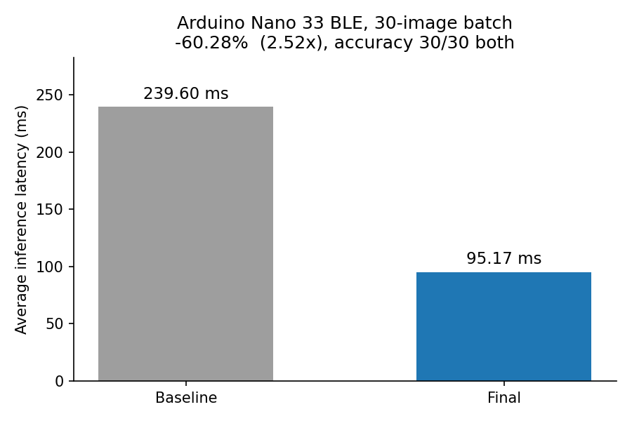
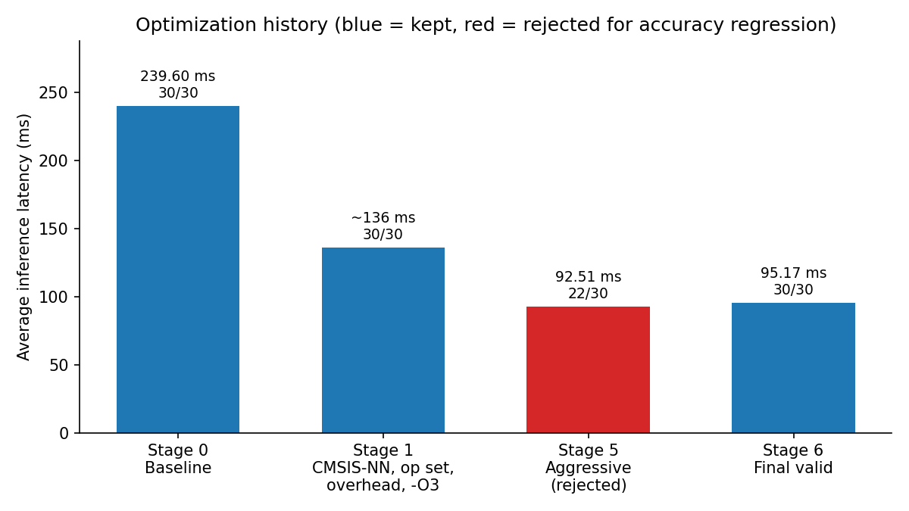

# TFLite Micro Latency Optimization on Arduino Nano 33 BLE

> Optimizing the runtime execution path of a fixed MNIST TFLite model without changing its graph, weights, or quantization parameters.
>
> 한국어 버전은 [아래](#한국어-korean)에 있습니다.

| Metric | Baseline | Final |
|---|---:|---:|
| Average latency (30-image batch) | 239.60 ms | **95.17 ms** |
| Accuracy (30 fixed test images) | 100% | **100% (30/30)** |
| Speedup | 1.00x | **2.52x** |
| Latency reduction | - | **60.28% (144.43 ms)** |
| Model file (`proj_mnist.tflite`) | unchanged | unchanged |




## Highlights

- **239.60 ms to 95.17 ms** end-to-end inference latency on an ARM Cortex-M4F MCU, with the `.tflite` file, layer graph, weights, and quantization parameters left untouched.
- **Fixed-shape kernel specialization**: pair-major prepacked filters, DSP `SMLAD` dual-MAC accumulation, and zero-contribution activation skipping replaced the generic TFLM/CMSIS-NN convolution path for every conv layer.
- **The fastest version was rejected.** A 92.51 ms variant dropped accuracy to 22/30 (73.3%). Each change was re-isolated and only the accuracy-preserving set was kept, giving 95.17 ms at 30/30.

## Overview

Course project (Embedded System Design, 2026-05-28 to 2026-06-18). The task: take a provided quantized MNIST classifier (`proj_mnist.tflite`) running under TensorFlow Lite Micro on an Arduino Nano 33 BLE and minimize inference latency **without touching the model**.

Constraints:

- `.tflite` model file, layer graph, filter shapes, strides, padding, and tensor shapes must stay the same
- weight, bias, scale, and zero-point values must stay the same
- accuracy must not regress
- the only optimization target is the TFLM runtime, its kernels, and the memory/execution path

So this is not a retraining, pruning, or model-swap project. It is a runtime profiling and kernel-engineering project on a fixed workload.

## System / Architecture

Model execution path (all tensors int8 after the first Quantize; shapes verified against the kernel dispatch code):

```
uint8 [1,28,28,1]  input image
        │
        ▼  QUANTIZE   uint8 -> int8 (zero-point shift)
Conv1   3x3, stride 2, SAME      -> [1,14,14,8]      ~14.1K MAC
Conv2   3x3, stride 1, SAME      -> [1,14,14,16]     ~225.8K MAC
Conv3   3x3, stride 2, SAME      -> [1,7,7,32]       ~225.8K MAC
Conv4   3x3, stride 1, SAME      -> [1,7,7,64]       ~903.2K MAC
Conv5   3x3, stride 2, SAME      -> [1,4,4,128]      ~1179.6K MAC
MEAN    over H,W (global avg pool) -> [1,128]
FULLY_CONNECTED                  -> [1,10]
        │
        ▼  QUANTIZE   int8 -> uint8
uint8 [10] class scores  ->  argmax
```

Where the time goes was not fully explained by MAC count. On this MCU, memory access pattern, generic-kernel branch overhead, requantization, filter layout, code locality, and use of the Cortex-M4 DSP extension mattered as much as arithmetic count. See [docs/architecture.md](docs/architecture.md).

Runtime layering after optimization:

```
Arduino sketch (firmware/proj2_final_best)
  └─ MicroMutableOpResolver<4>: QUANTIZE, CONV_2D, MEAN, FULLY_CONNECTED
       └─ patched TFLM kernels (tflm_patches/)
            ├─ conv.cpp            fixed-shape Conv1..Conv5 fast paths
            ├─ fully_connected.cpp direct int8 FC path
            ├─ quantize.cpp        fixed-size quantize fast paths
            └─ reduce.cpp          fixed-shape MEAN fast path
                 └─ CMSIS-NN / ARM DSP (SMLAD) on nRF52840 Cortex-M4F
```

## Environment

| Category | Stack |
|---|---|
| Hardware | Arduino Nano 33 BLE (nRF52840, ARM Cortex-M4F, 64 MHz, 256 KB RAM, 1 MB flash) |
| Language | C / C++ (firmware and kernels), Python (result analysis) |
| Framework | TensorFlow Lite Micro (Arduino `TensorFlowLite` library), CMSIS-NN |
| Toolchain | Arduino IDE, `arduino:mbed_nano:nano33ble` core, GCC `-O3` via `platform.local.txt` |
| Model | `proj_mnist.tflite` (int8 CNN, uint8 I/O), provided by the course |
| Measurement | `micros()` around input copy + `Invoke()` + argmax, 10 warm-up runs, 30-image batch |

## Implementation

Compile-time configuration of the final build (`platform/platform.local.txt`):

| Flag | Effect |
|---|---|
| `-O3 -fomit-frame-pointer -fno-unwind-tables -fno-asynchronous-unwind-tables -fno-common` | Compiler optimization level for the whole core and library |
| `-DARM_MATH_DSP=1 -DCMSIS_NN=1` | Keep CMSIS-NN kernels and enable DSP intrinsics (`SMLAD`) |
| `-DPROJECT2_CONV1_DIRECT_SPARSE=1` | Conv1: direct fixed-shape kernel on the original filter tensor, skipping zero input contributions |
| `-DPROJECT2_CONV2_PAIRMAJOR_SPARSE_ALWAYS=1` (also CONV3, CONV4) | Conv2..Conv4: pair-major prepacked filter kernels, always on |
| `-DPROJECT2_CONV5_SPARSE_V1=1` | Conv5: pair-major sparse kernel, always on (the hybrid threshold variant is compiled out) |
| `-DPROJECT2_DIRECTION_C_CONV45_FIXED=1`, `_DIRECT_PRIMITIVE=0` | Fallback fixed-dimension CMSIS-NN call for Conv4/Conv5 if a shape check fails |
| `-DPROJECT2_DISABLE_KERNEL_TIMER=1 -DPROJECT2_ENABLE_KERNEL_PROFILING=0` | Per-layer profiling counters removed from the final measurement build |

What each fast path does (all of them check tensor shape and type first and fall back to the stock TFLM implementation otherwise):

1. **Conv2D dispatch** (`tflm_patches/cmsis_nn/conv.cpp`): `Register_CONV_2D` routes straight to an int8 path, removing the int4-unpack wrapper object that stock TFLM builds on every call. Inside, five shape-matched fast paths cover Conv1..Conv5.
2. **Conv1 direct path**: 28x28x1 input, 8 filters, stride 2. Reads the original filter tensor and skips input pixels whose dequantized value is zero.
3. **Conv2..Conv5 pair-major kernels**: each layer's int8 filter is prepacked at build time into a flash table laid out `[kh_kw_input_channel_pair][output_channel]` (`project2_conv*_filter_pairmajor_packed.h`, generated from the unchanged `.tflite`). Two int8 activations are packed as int16 lanes and multiplied against two packed weights with one `SMLAD`, accumulating contiguously across output channels instead of strided weight reads. When both activations in a pair are exactly the zero point (q == -128 with input offset 128), the pair contributes nothing and is skipped.
4. **Quantize** (`kernels/quantize.cpp`): the 784-element uint8 to int8 input quantize and the 10-element int8 to uint8 output quantize become plain offset shifts (unrolled by 8 for the input).
5. **Mean** (`kernels/reduce.cpp`): the `[1,4,4,128] -> [1,128]` global average pool uses a precomputed fixed-point multiplier for this tensor's scale pair (`input_scale / (16 * output_scale)`), summing 16 spatial positions per channel with NHWC stride 128.
6. **Fully connected** (`cmsis_nn/fully_connected.cpp`): skips the generic type switch and int4-unpack wrapper and calls `arm_fully_connected_s8` directly.
7. **Sketch level** (`firmware/`): only the four ops used by the model are registered, debug prints and per-prediction output are compiled out, and the sketch itself applies `#pragma GCC optimize("O3")` and `("unroll-loops")`.

## Challenge

After the "obvious" work (CMSIS-NN path, trimming op registration, removing measurement overhead, compiler flags) latency settled around 136 ms. Further changes in the same style produced only small gains. Conv4 and Conv5 dominated the MAC count, so the natural question was how to compute the same thing faster. That question stalled.

## Approach

The question was changed to **"does every MAC actually have to be executed?"**

- Profiled `Invoke()` at layer and kernel level: generic kernel branches, memory access, requantization, per-layer hot paths, and the activation distribution feeding each layer.
- Observed that roughly **54% of the Conv4 / Conv5 input activations sit at the zero point**, contributing exactly zero to the accumulation. Those MACs can be skipped without changing the result.
- Since the model graph and every tensor shape are fixed, the generic kernels' runtime shape handling could be replaced with shape-specialized paths and a weight layout chosen for the access pattern (pair-major, contiguous across output channels).
- Each change was compiled with its own flag (`PROJECT2_*`), measured in isolation with the same 30-image batch, and kept only if end-to-end latency dropped and accuracy stayed at 30/30.

Full history in [docs/optimization_history.md](docs/optimization_history.md).

## Validation

Every candidate build ran the same protocol (`RunBatch30Release()` in the sketch):

- 10 warm-up inferences on image 0
- 30 fixed MNIST test images with known labels (`test_images_30.h`, `TEST_IMAGES_REAL_DATA=1`)
- timed region per image: `memcpy` into the input tensor, `interpreter->Invoke()`, argmax over the 10 uint8 outputs
- output lines `BATCH30_STATS,...,avg_us=...,min_us=...,max_us=...,runs=30` and `ACCURACY,...,correct=N,total=30,accuracy=...`
- tensor arena 160 * 1024 bytes, `MicroMutableOpResolver<4>`

Accuracy was compared against the baseline (30/30). A build that lowered accuracy was rejected regardless of latency. Details in [docs/validation.md](docs/validation.md).

## Results

| Stage | Change | Avg latency | Accuracy | Kept |
|---|---|---:|---:|:---:|
| 0 | Baseline TFLM path | 239.60 ms | 30/30 | - |
| 1 | CMSIS-NN path, minimal op set, debug/measurement overhead removed, `-O3` | ~136 ms | 30/30 | yes |
| 2-4 | Fixed-shape kernels, pair-major prepacked filters, zero-activation skip, fast quantize/mean/FC | | | yes |
| 5 | Branch-free / hard-coded requantization variant ("aggressive") | 92.51 ms | 22/30 (73.3%) | **no** |
| 6 | Final valid build (this repository) | **95.17 ms** | **30/30** | yes |



Reduction 239.60 -> 95.17 ms = 144.43 ms (60.28%), speedup 2.52x. The numbers are taken from the final project report; the raw Serial logs of the runs were not kept, so no log files are included here. The charts in `assets/` are generated from these reported values by `scripts/plot_results.py`.

## Engineering Takeaways

1. **MAC count alone does not explain MCU latency.** Memory access, branch structure, requantization, and generic runtime overhead can dominate even when the arithmetic count is fixed.
2. **Optimization must remain measurable.** Each change was isolated behind its own compile flag and benchmarked with the same protocol to see whether it actually reduced end-to-end latency.
3. **The fastest implementation is not always the valid implementation.** The 92.51 ms build was rejected because accuracy fell to 73.3%. The final build prioritizes latency and functional correctness together.
4. **Fixed workloads enable specialization.** Because the graph and tensor shapes never change, generic runtime paths could be replaced by specialized execution paths with a weight layout matched to the access pattern.

## Repository Structure

```
tflite-micro-latency-optimization/
├── README.md
├── LICENSE
├── .gitignore
├── firmware/
│   └── proj2_final_best/
│       ├── proj2_final_best.ino        final benchmark sketch (BATCH30 protocol)
│       ├── proj_mnist_model_data.h     model as C array (generated from proj_mnist.tflite, unchanged)
│       ├── test_images_30.h            30 fixed MNIST test images + labels
│       └── profile_image_default.h     fixed all-zero profiling input
├── tflm_patches/
│   ├── README.md                       where each file goes in the Arduino TFLM library
│   ├── cmsis_nn/
│   │   ├── conv.cpp                    Conv1..Conv5 fixed-shape fast paths
│   │   ├── fully_connected.cpp         direct int8 FC path
│   │   └── project2_conv{2,3,4,5}_filter_pairmajor_packed.h   prepacked filters
│   └── kernels/
│       ├── quantize.cpp                fixed-size quantize fast paths
│       └── reduce.cpp                  fixed-shape MEAN fast path
├── platform/
│   ├── platform.local.txt              final compile flags
│   └── README.md
├── model/
│   ├── proj_mnist.tflite               course-provided model, unchanged
│   └── README.md
├── docs/
│   ├── architecture.md
│   ├── optimization_history.md
│   └── validation.md
├── scripts/
│   └── plot_results.py                 regenerates assets/*.png from reported numbers
└── assets/
    ├── latency_comparison.png
    └── optimization_history.png
```

## Reproduction

Hardware required: an Arduino Nano 33 BLE. This cleanup did not re-flash the board; the steps below are the procedure used during the project.

1. Arduino IDE with the `Arduino Mbed OS Nano Boards` core (`arduino:mbed_nano`) and the `Arduino_TensorFlowLite` library installed.
2. Copy the files in `tflm_patches/` over the corresponding files in the installed TFLM library (paths listed in [tflm_patches/README.md](tflm_patches/README.md)). Keep backups of the originals.
3. Copy `platform/platform.local.txt` next to the core's `platform.txt` (see [platform/README.md](platform/README.md)). This is what enables the `PROJECT2_*` fast paths and `-O3`.
4. Open `firmware/proj2_final_best/proj2_final_best.ino`, select board `Arduino Nano 33 BLE`, upload.
5. Open Serial Monitor at 115200 baud. Expected output shape:

```
BOOT,project=EmbeddedSystemDesign_Project2
BOOT,mode=PROJECT2_AGGRESSIVE_SAFE
RUN_META,mode=PROJECT2_AGGRESSIVE_SAFE,board=Arduino Nano 33 BLE,warmup=10,tensor_arena=163840,...
SIMD_META,arm_feature_dsp=1,arm_math_dsp=1,cmsis_nn_macro=1
BATCH30_STATS,mode=PROJECT2_AGGRESSIVE_SAFE,avg_us=<avg>,min_us=<min>,max_us=<max>,runs=30
ACCURACY,mode=PROJECT2_AGGRESSIVE_SAFE,correct=30,total=30,accuracy=1.0000
RUN_DONE
```

`python scripts/plot_results.py` regenerates the two charts (needs `matplotlib`).

## Notes / Limitations

- **Original coursework vs. portfolio cleanup.** Everything under `firmware/`, `tflm_patches/`, `platform/`, and `model/` is the original submission, byte-for-byte except for two cleanups: the sketch's student-ID suffix was dropped to give `proj2_final_best.ino` (folder renamed to match, as Arduino requires), and an unused seed constant holding a student ID was removed from `test_images_30.h` (the selected indices are hard-coded, so behavior is unchanged). `README.md`, `docs/`, `scripts/`, `assets/`, `LICENSE`, and `.gitignore` were added afterwards for publication.
- The MNIST model and its C-array header were provided by the course and are included only so the sketch builds. The pair-major packed filter headers are derived from that model's weights (no values changed, only reordered).
- The baseline sketch, the intermediate ~136 ms build, and the rejected 92.51 ms build are not part of the submission archive and are therefore not included. Their behavior is described in `docs/optimization_history.md`.
- Raw Serial benchmark logs were not retained; results are quoted from the final report.
- The patches target the TFLM version bundled with the Arduino `Arduino_TensorFlowLite` library at the time of the project (mid-2026). Kernel file layout in other TFLM versions may differ.
- The fast paths are model-specific by design. They fall back to stock TFLM code for any other tensor shape, but they are not a general-purpose optimization.

## License

MIT for the files written in this project (sketch, patches, docs). The patched kernel files are derived from TensorFlow Lite Micro sources, which remain under the Apache License 2.0 (headers preserved in each file). The MNIST model belongs to the course.
---

## 한국어 (Korean)

### TFLite Micro Latency Optimization on Arduino Nano 33 BLE

> 고정된 MNIST TFLite 모델의 graph, weight, quantization parameter를 바꾸지 않고 runtime 실행 경로를 최적화한 프로젝트다.

| 항목 | Baseline | Final |
|---|---:|---:|
| 평균 latency (30-image batch) | 239.60 ms | **95.17 ms** |
| 정확도 (고정 테스트 이미지 30장) | 100% | **100% (30/30)** |
| Speedup | 1.00x | **2.52x** |
| Latency 감소 | - | **60.28% (144.43 ms)** |
| 모델 파일 (`proj_mnist.tflite`) | 변경 없음 | 변경 없음 |


### Highlights

- ARM Cortex-M4F MCU에서 end-to-end 추론 latency를 **239.60 ms에서 95.17 ms로** 줄였다. `.tflite` 파일, layer graph, weight, quantization parameter는 그대로 두었다.
- **Fixed-shape kernel specialization**: pair-major prepacked filter, DSP `SMLAD` dual-MAC 누산, zero-contribution activation skip으로 모든 conv layer의 generic TFLM/CMSIS-NN convolution 경로를 대체했다.
- **가장 빠른 버전은 채택하지 않았다.** 92.51 ms 버전은 정확도가 22/30 (73.3%)으로 떨어졌다. 각 변경을 다시 분리해 검증하고, 정확도를 유지하는 조합만 남겨 30/30에서 95.17 ms를 얻었다.

### Overview

수업 프로젝트다 (임베디드시스템설계, 2026-05-28 ~ 2026-06-18). 과제는 Arduino Nano 33 BLE에서 TensorFlow Lite Micro로 동작하는 제공 quantized MNIST 분류기(`proj_mnist.tflite`)의 추론 latency를 **모델을 건드리지 않고** 최소화하는 것이었다.

제약 조건:

- `.tflite` 모델 파일, layer graph, filter shape, stride, padding, tensor shape를 유지해야 한다
- weight, bias, scale, zero-point 값을 유지해야 한다
- 정확도가 떨어지면 안 된다
- 최적화 대상은 TFLM runtime, kernel, memory/실행 경로뿐이다

즉 재학습, pruning, 모델 교체 프로젝트가 아니다. 고정된 workload에 대한 runtime profiling과 kernel engineering 프로젝트다.

### System / Architecture

모델 실행 경로 (첫 Quantize 이후 모든 tensor는 int8이며, shape는 kernel dispatch 코드와 대조해 확인했다):

```
uint8 [1,28,28,1]  input image
        │
        ▼  QUANTIZE   uint8 -> int8 (zero-point shift)
Conv1   3x3, stride 2, SAME      -> [1,14,14,8]      ~14.1K MAC
Conv2   3x3, stride 1, SAME      -> [1,14,14,16]     ~225.8K MAC
Conv3   3x3, stride 2, SAME      -> [1,7,7,32]       ~225.8K MAC
Conv4   3x3, stride 1, SAME      -> [1,7,7,64]       ~903.2K MAC
Conv5   3x3, stride 2, SAME      -> [1,4,4,128]      ~1179.6K MAC
MEAN    over H,W (global avg pool) -> [1,128]
FULLY_CONNECTED                  -> [1,10]
        │
        ▼  QUANTIZE   int8 -> uint8
uint8 [10] class scores  ->  argmax
```

시간이 어디에 쓰이는지는 MAC 수만으로 설명되지 않았다. 이 MCU에서는 memory access pattern, generic-kernel branch overhead, requantization, filter layout, code locality, Cortex-M4 DSP extension 활용 여부가 연산량만큼 중요했다. [docs/architecture.md](docs/architecture.md)를 참고한다.

최적화 후 runtime 계층 구조:

```
Arduino sketch (firmware/proj2_final_best)
  └─ MicroMutableOpResolver<4>: QUANTIZE, CONV_2D, MEAN, FULLY_CONNECTED
       └─ patched TFLM kernels (tflm_patches/)
            ├─ conv.cpp            fixed-shape Conv1..Conv5 fast paths
            ├─ fully_connected.cpp direct int8 FC path
            ├─ quantize.cpp        fixed-size quantize fast paths
            └─ reduce.cpp          fixed-shape MEAN fast path
                 └─ CMSIS-NN / ARM DSP (SMLAD) on nRF52840 Cortex-M4F
```

### Environment

| 구분 | Stack |
|---|---|
| Hardware | Arduino Nano 33 BLE (nRF52840, ARM Cortex-M4F, 64 MHz, 256 KB RAM, 1 MB flash) |
| Language | C / C++ (firmware, kernel), Python (결과 분석) |
| Framework | TensorFlow Lite Micro (Arduino `TensorFlowLite` library), CMSIS-NN |
| Toolchain | Arduino IDE, `arduino:mbed_nano:nano33ble` core, `platform.local.txt`를 통한 GCC `-O3` |
| Model | `proj_mnist.tflite` (int8 CNN, uint8 I/O), 수업에서 제공 |
| Measurement | input copy + `Invoke()` + argmax 구간을 `micros()`로 측정, warm-up 10회, 30-image batch |

### Implementation

최종 빌드의 compile-time 설정 (`platform/platform.local.txt`):

| Flag | 효과 |
|---|---|
| `-O3 -fomit-frame-pointer -fno-unwind-tables -fno-asynchronous-unwind-tables -fno-common` | core와 library 전체의 compiler optimization level |
| `-DARM_MATH_DSP=1 -DCMSIS_NN=1` | CMSIS-NN kernel 유지, DSP intrinsic (`SMLAD`) 활성화 |
| `-DPROJECT2_CONV1_DIRECT_SPARSE=1` | Conv1: 원본 filter tensor를 그대로 쓰는 direct fixed-shape kernel, zero input contribution skip |
| `-DPROJECT2_CONV2_PAIRMAJOR_SPARSE_ALWAYS=1` (CONV3, CONV4도 동일) | Conv2..Conv4: pair-major prepacked filter kernel, 항상 사용 |
| `-DPROJECT2_CONV5_SPARSE_V1=1` | Conv5: pair-major sparse kernel, 항상 사용 (hybrid threshold 변형은 컴파일에서 제외) |
| `-DPROJECT2_DIRECTION_C_CONV45_FIXED=1`, `_DIRECT_PRIMITIVE=0` | Conv4/Conv5의 shape 검사가 실패할 때 쓰는 fixed-dimension CMSIS-NN fallback 호출 |
| `-DPROJECT2_DISABLE_KERNEL_TIMER=1 -DPROJECT2_ENABLE_KERNEL_PROFILING=0` | 최종 측정 빌드에서 layer별 profiling counter 제거 |

각 fast path의 동작 (모두 tensor shape와 type을 먼저 검사하고, 맞지 않으면 기본 TFLM 구현으로 fallback한다):

1. **Conv2D dispatch** (`tflm_patches/cmsis_nn/conv.cpp`): `Register_CONV_2D`가 int8 경로로 바로 연결되어, 기본 TFLM이 호출마다 만드는 int4-unpack wrapper 객체를 제거한다. 내부에서는 shape가 일치하는 fast path 5개가 Conv1..Conv5를 담당한다.
2. **Conv1 direct path**: 28x28x1 입력, filter 8개, stride 2. 원본 filter tensor를 읽고, dequantize 값이 0인 입력 pixel은 건너뛴다.
3. **Conv2..Conv5 pair-major kernel**: 각 layer의 int8 filter를 빌드 시점에 `[kh_kw_input_channel_pair][output_channel]` 배치의 flash table로 prepack한다 (`project2_conv*_filter_pairmajor_packed.h`, 변경 없는 `.tflite`에서 생성). int8 activation 2개를 int16 lane으로 묶고 packed weight 2개와 `SMLAD` 한 번으로 곱해, strided weight read 대신 output channel 방향으로 연속 누산한다. pair의 두 activation이 모두 정확히 zero point(input offset 128 기준 q == -128)이면 그 pair는 기여가 없으므로 건너뛴다.
4. **Quantize** (`kernels/quantize.cpp`): 784-element uint8 → int8 입력 quantize와 10-element int8 → uint8 출력 quantize를 단순 offset shift로 바꿨다 (입력은 8단위로 unroll).
5. **Mean** (`kernels/reduce.cpp`): `[1,4,4,128] -> [1,128]` global average pool에 이 tensor의 scale 쌍(`input_scale / (16 * output_scale)`)에 대한 fixed-point multiplier를 미리 계산해 두고, NHWC stride 128로 channel당 spatial 위치 16개를 합산한다.
6. **Fully connected** (`cmsis_nn/fully_connected.cpp`): generic type switch와 int4-unpack wrapper를 건너뛰고 `arm_fully_connected_s8`을 직접 호출한다.
7. **Sketch level** (`firmware/`): 모델이 쓰는 op 4개만 등록하고, debug print와 예측별 출력은 컴파일에서 제외하며, sketch 자체에 `#pragma GCC optimize("O3")`와 `("unroll-loops")`를 적용한다.

### Challenge

"당연한" 작업(CMSIS-NN 경로, op 등록 정리, 측정 overhead 제거, compiler flag)을 마친 뒤 latency는 136 ms 부근에서 정체됐다. 같은 방식의 추가 변경은 작은 개선만 냈다. MAC 수는 Conv4와 Conv5가 지배적이었으므로, 자연스러운 질문은 같은 계산을 어떻게 더 빨리 하느냐였다. 이 질문은 막혔다.

### Approach

질문을 **"모든 MAC을 실제로 수행해야 하는가?"** 로 바꿨다.

- `Invoke()`를 layer와 kernel 수준에서 profiling했다: generic kernel branch, memory access, requantization, layer별 hot path, 각 layer에 들어가는 activation 분포.
- **Conv4 / Conv5 입력 activation의 약 54%가 zero point에 위치**해 누산에 정확히 0을 기여한다는 점을 확인했다. 이 MAC은 결과를 바꾸지 않고 건너뛸 수 있다.
- 모델 graph와 모든 tensor shape가 고정되어 있으므로, generic kernel의 runtime shape 처리를 shape-specialized 경로로 바꾸고, access pattern에 맞춘 weight layout(pair-major, output channel 방향 연속)을 택할 수 있었다.
- 각 변경은 고유 flag(`PROJECT2_*`)로 컴파일해 같은 30-image batch로 단독 측정했고, end-to-end latency가 줄고 정확도가 30/30으로 유지될 때만 남겼다.

전체 이력은 [docs/optimization_history.md](docs/optimization_history.md)에 있다.

### Validation

모든 후보 빌드는 같은 절차(sketch의 `RunBatch30Release()`)로 실행했다:

- image 0으로 warm-up 추론 10회
- label이 알려진 고정 MNIST 테스트 이미지 30장 (`test_images_30.h`, `TEST_IMAGES_REAL_DATA=1`)
- 이미지당 측정 구간: input tensor로 `memcpy`, `interpreter->Invoke()`, uint8 출력 10개에 대한 argmax
- 출력 줄 `BATCH30_STATS,...,avg_us=...,min_us=...,max_us=...,runs=30` 및 `ACCURACY,...,correct=N,total=30,accuracy=...`
- tensor arena 160 * 1024 bytes, `MicroMutableOpResolver<4>`

정확도는 baseline(30/30)과 비교했다. 정확도가 떨어진 빌드는 latency와 무관하게 제외했다. 상세 내용은 [docs/validation.md](docs/validation.md)에 있다.

### Results

| 단계 | 변경 | 평균 latency | 정확도 | 채택 |
|---|---|---:|---:|:---:|
| 0 | Baseline TFLM 경로 | 239.60 ms | 30/30 | - |
| 1 | CMSIS-NN 경로, 최소 op set, debug/측정 overhead 제거, `-O3` | ~136 ms | 30/30 | yes |
| 2-4 | Fixed-shape kernel, pair-major prepacked filter, zero-activation skip, fast quantize/mean/FC | | | yes |
| 5 | Branch-free / hard-coded requantization 변형 ("aggressive") | 92.51 ms | 22/30 (73.3%) | **no** |
| 6 | 최종 유효 빌드 (이 저장소) | **95.17 ms** | **30/30** | yes |


239.60 -> 95.17 ms로 144.43 ms(60.28%) 감소, speedup 2.52x다. 수치는 최종 프로젝트 보고서에서 가져왔다. 실행 당시의 raw Serial log는 보관되지 않아 log 파일은 포함하지 않았다. `assets/`의 차트는 이 보고 수치로부터 `scripts/plot_results.py`가 생성한 것이다.

### Engineering Takeaways

1. **MAC 수만으로는 MCU latency를 설명할 수 없다.** 연산량이 고정되어 있어도 memory access, branch 구조, requantization, generic runtime overhead가 지배적일 수 있다.
2. **최적화는 측정 가능해야 한다.** 각 변경을 고유 compile flag 뒤에 분리하고 같은 절차로 benchmark해, 실제로 end-to-end latency가 줄었는지 확인했다.
3. **가장 빠른 구현이 항상 유효한 구현은 아니다.** 92.51 ms 빌드는 정확도가 73.3%로 떨어져 제외했다. 최종 빌드는 latency와 기능적 정확성을 함께 우선한다.
4. **고정된 workload는 specialization을 가능하게 한다.** graph와 tensor shape가 바뀌지 않으므로, generic runtime 경로를 access pattern에 맞춘 weight layout을 가진 specialized 실행 경로로 대체할 수 있었다.

### Repository Structure

```
tflite-micro-latency-optimization/
├── README.md
├── LICENSE
├── .gitignore
├── firmware/
│   └── proj2_final_best/
│       ├── proj2_final_best.ino        최종 benchmark sketch (BATCH30 절차)
│       ├── proj_mnist_model_data.h     C array 형태의 모델 (proj_mnist.tflite에서 생성, 변경 없음)
│       ├── test_images_30.h            고정 MNIST 테스트 이미지 30장 + label
│       └── profile_image_default.h     고정 all-zero profiling 입력
├── tflm_patches/
│   ├── README.md                       각 파일이 Arduino TFLM library의 어디에 들어가는지
│   ├── cmsis_nn/
│   │   ├── conv.cpp                    Conv1..Conv5 fixed-shape fast path
│   │   ├── fully_connected.cpp         direct int8 FC path
│   │   └── project2_conv{2,3,4,5}_filter_pairmajor_packed.h   prepacked filter
│   └── kernels/
│       ├── quantize.cpp                fixed-size quantize fast path
│       └── reduce.cpp                  fixed-shape MEAN fast path
├── platform/
│   ├── platform.local.txt              최종 compile flag
│   └── README.md
├── model/
│   ├── proj_mnist.tflite               수업 제공 모델, 변경 없음
│   └── README.md
├── docs/
│   ├── architecture.md
│   ├── optimization_history.md
│   └── validation.md
├── scripts/
│   └── plot_results.py                 보고 수치로부터 assets/*.png 재생성
└── assets/
    ├── latency_comparison.png
    └── optimization_history.png
```

### Reproduction

Arduino Nano 33 BLE 보드가 필요하다. 이번 정리 과정에서 보드를 다시 flash하지는 않았다. 아래는 프로젝트 당시 사용한 절차다.

1. Arduino IDE에 `Arduino Mbed OS Nano Boards` core(`arduino:mbed_nano`)와 `Arduino_TensorFlowLite` library를 설치한다.
2. `tflm_patches/`의 파일을 설치된 TFLM library의 해당 파일 위에 복사한다 (경로는 [tflm_patches/README.md](tflm_patches/README.md)에 있다). 원본은 백업해 둔다.
3. `platform/platform.local.txt`를 core의 `platform.txt` 옆에 복사한다 ([platform/README.md](platform/README.md) 참고). 이 파일이 `PROJECT2_*` fast path와 `-O3`를 활성화한다.
4. `firmware/proj2_final_best/proj2_final_best.ino`를 열고 보드를 `Arduino Nano 33 BLE`로 선택한 뒤 업로드한다.
5. Serial Monitor를 115200 baud로 연다. 예상 출력 형태:

```
BOOT,project=EmbeddedSystemDesign_Project2
BOOT,mode=PROJECT2_AGGRESSIVE_SAFE
RUN_META,mode=PROJECT2_AGGRESSIVE_SAFE,board=Arduino Nano 33 BLE,warmup=10,tensor_arena=163840,...
SIMD_META,arm_feature_dsp=1,arm_math_dsp=1,cmsis_nn_macro=1
BATCH30_STATS,mode=PROJECT2_AGGRESSIVE_SAFE,avg_us=<avg>,min_us=<min>,max_us=<max>,runs=30
ACCURACY,mode=PROJECT2_AGGRESSIVE_SAFE,correct=30,total=30,accuracy=1.0000
RUN_DONE
```

`python scripts/plot_results.py`로 차트 2개를 재생성한다 (`matplotlib` 필요).

### Notes / Limitations

- **원본 과제물과 포트폴리오 정리의 구분.** `firmware/`, `tflm_patches/`, `platform/`, `model/` 아래는 원본 제출물이며, 두 가지 정리를 제외하면 byte 단위로 동일하다: sketch 파일명의 학번 접미사를 제거해 `proj2_final_best.ino`로 바꿨고(Arduino 요구사항에 따라 폴더명도 맞춤), `test_images_30.h`에서 학번이 들어 있던 미사용 seed 상수를 제거했다(선택된 index는 hard-coded라 동작은 동일하다). `README.md`, `docs/`, `scripts/`, `assets/`, `LICENSE`, `.gitignore`는 공개를 위해 이후에 추가했다.
- MNIST 모델과 그 C-array header는 수업에서 제공된 것이며, sketch가 빌드되도록 하기 위해서만 포함했다. pair-major packed filter header는 그 모델의 weight에서 파생된 것이다(값 변경 없이 순서만 재배치).
- baseline sketch, 중간 단계의 ~136 ms 빌드, 제외된 92.51 ms 빌드는 제출 archive에 없어 포함하지 않았다. 동작은 `docs/optimization_history.md`에 기술했다.
- raw Serial benchmark log는 보관되지 않았다. 결과는 최종 보고서에서 인용했다.
- patch는 프로젝트 당시(2026년 중반) Arduino `Arduino_TensorFlowLite` library에 번들된 TFLM 버전을 대상으로 한다. 다른 TFLM 버전에서는 kernel 파일 배치가 다를 수 있다.
- fast path는 설계상 모델 특화다. 다른 tensor shape에서는 기본 TFLM 코드로 fallback하지만, 범용 최적화는 아니다.

### License

이 프로젝트에서 작성한 파일(sketch, patch, docs)은 MIT다. patch된 kernel 파일은 TensorFlow Lite Micro 소스에서 파생된 것으로 Apache License 2.0을 유지한다(각 파일의 header 보존). MNIST 모델은 수업 측에 귀속된다.
